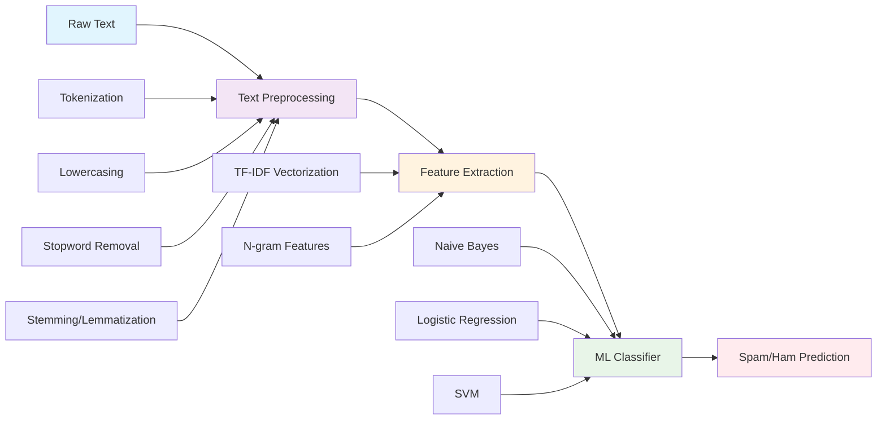

<div align="center">

# 📧 Spam Detection with Machine Learning

[](https://opensource.org/licenses/MIT)
[](https://www.python.org/downloads/)
[](https://scikit-learn.org/)
[](https://streamlit.io/)
[](https://fastapi.tiangolo.com/)
[]()

**🚀 Real-time spam detection using traditional machine learning with dual deployment interfaces**

[📖 Documentation](#-table-of-contents) • [🚀 Quick Start](#-quick-start) • [🌐 Deployment](#-deployment-guide) • [💡 Usage](#-usage-examples) 

</div>

---

## 📊 Project Overview

This project implements a **production-ready spam detection system** using traditional machine learning algorithms. The system combines robust text preprocessing, feature extraction, and classification techniques to accurately identify spam messages in real-time. Built with both interactive web interface (Streamlit) and REST API (FastAPI) for maximum flexibility.

### 🎯 Key Features

<div align="center">

| Feature | Description | Benefit |
|---------|-------------|---------|
| **📧 Text Classification** | Binary spam/ham detection | High accuracy spam filtering |
| **🔧 Preprocessing Pipeline** | Tokenization, stopword removal, stemming | Robust text handling |
| **📊 Feature Engineering** | TF-IDF vectorization | Effective text representation |
| **🤖 ML Algorithms** | Naive Bayes, Logistic Regression, SVM | Proven classification methods |
| **🌐 Dual Interface** | Streamlit UI + FastAPI REST | Flexible integration options |
| **⚡ Real-time Processing** | Instant predictions | Production-ready performance |

</div>

### 🛠️ Technologies Used

- **🤖 Machine Learning**: Scikit-learn for model training and pipeline
- **📝 Text Processing**: NLTK/spaCy for preprocessing and feature extraction
- **🌐 Web Interface**: Streamlit for interactive demo and testing
- **🔌 API Service**: FastAPI for REST API endpoints
- **📊 Data Analysis**: Pandas, NumPy for data manipulation
- **📈 Visualization**: Matplotlib, Seaborn for EDA and metrics
- **☁️ Deployment**: Multi-platform cloud deployment support

---

## 📑 Table of Contents

- [🎯 Project Overview](#-project-overview)
- [🏗️ Model Architecture](#️-model-architecture)
- [📋 Prerequisites](#-prerequisites)
- [🚀 Quick Start](#-quick-start)
- [📦 Installation Guide](#-installation-guide)
- [💡 Usage Examples](#-usage-examples)
- [🌐 Deployment Guide](#-deployment-guide)
- [📊 Model Performance](#-model-performance)
---

## 🏗️ Model Architecture

### 🔄 ML Pipeline



### 📊 Technical Implementation

<table>
<tr>
<td width="50%">

**🔧 Preprocessing Steps**
- **Tokenization**: Split text into words
- **Lowercasing**: Normalize text case
- **Stopword Removal**: Filter common words
- **Stemming/Lemmatization**: Reduce words to roots
- **Special Character Handling**: Clean punctuation

</td>
<td width="50%">

**📈 Feature Engineering**
- **TF-IDF Vectorization**: Term frequency analysis
- **N-gram Features**: Capture word sequences
- **Character-level Features**: Detect patterns
- **Statistical Features**: Text length, word count
- **Domain-specific Features**: URLs, numbers

</td>
</tr>
</table>

### 🧠 Model Selection

| Algorithm | Strengths | Use Case |
|-----------|-----------|----------|
| **Naive Bayes** | Fast, works well with small datasets | Quick prototyping |
| **Logistic Regression** | Interpretable, good baseline | Production deployment |
| **SVM** | Handles high-dimensional data well | Complex feature spaces |
| **Random Forest** | Robust, handles overfitting | Ensemble approach |

---

## 📋 Prerequisites

### 🐍 System Requirements

- **Python**: 3.8+ (3.10 recommended)
- **Memory**: Minimum 2GB RAM (4GB recommended)
- **Storage**: 500MB free space
- **OS**: Windows 10+, macOS 10.14+, Ubuntu 18.04+

### 📚 Dataset Requirements

- **Format**: CSV with text and label columns
- **Size**: Minimum 1000 samples (10k+ recommended)
- **Labels**: Binary (spam/ham or 0/1)
- **Quality**: Clean, balanced dataset preferred

---

## 🚀 Quick Start

### ⚡ 60-Second Setup

```bash
# 1. Clone the repository
git clone https://github.com/jihed01-sc/Spam_detection.git
cd Spam_detection

# 2. Create virtual environment
python -m venv spam_env
source spam_env/bin/activate  # On Windows: spam_env\Scripts\activate

# 3. Install dependencies
pip install -r requirements.txt

# 4. Launch Streamlit app
streamlit run app_streamlit.py
```

### 🔌 API Quick Test

```bash
# Start FastAPI server
uvicorn app_fastapi:app --reload --port 8000

# Test with curl
curl -X POST "http://127.0.0.1:8000/predict" \
     -H "Content-Type: application/json" \
     -d '{"text": "Congratulations! You won a prize!"}'
```

---

## 📦 Installation Guide

### 🔧 Option 1: Standard Installation

```bash
# Create isolated environment
python -m venv spam_detection_env
source spam_detection_env/bin/activate  # Windows: spam_detection_env\Scripts\activate

# Upgrade pip for latest features
pip install --upgrade pip

# Install all dependencies
pip install -r requirements.txt

# Verify installation
python -c "import sklearn, streamlit, fastapi, joblib; print('✅ All dependencies installed')"
```

### 🐳 Option 2: Docker Installation

```dockerfile
# Dockerfile
FROM python:3.10-slim

WORKDIR /app

# Install system dependencies
RUN apt-get update && apt-get install -y \
    build-essential \
    curl \
    && rm -rf /var/lib/apt/lists/*

# Copy requirements and install Python dependencies
COPY requirements.txt .
RUN pip install --no-cache-dir -r requirements.txt

# Copy application files
COPY . .

# Expose ports
EXPOSE 8501 8000

# Health check
HEALTHCHECK --interval=30s --timeout=30s --start-period=5s --retries=3 \
  CMD curl -f http://localhost:8501/_stcore/health || exit 1

# Default command (can be overridden)
CMD ["streamlit", "run", "app_streamlit.py", "--server.port=8501", "--server.address=0.0.0.0"]
```

```bash
# Build and run container
docker build -t spam-detector .

# Run Streamlit interface
docker run -p 8501:8501 spam-detector

# Run FastAPI service
docker run -p 8000:8000 spam-detector uvicorn app_fastapi:app --host 0.0.0.0 --port 8000
```

### 📋 Enhanced Requirements

```txt
# Core ML and data processing
scikit-learn>=1.3.0
pandas>=1.5.0
numpy>=1.24.0
joblib>=1.3.0

# Text processing
nltk>=3.8
spacy>=3.6.0

# Web frameworks
streamlit>=1.28.0
fastapi>=0.104.0
uvicorn[standard]>=0.24.0

# Visualization
matplotlib>=3.7.0
seaborn>=0.12.0
plotly>=5.17.0
wordcloud>=1.9.0

# API utilities
python-multipart>=0.0.6
pydantic>=2.5.0
httpx>=0.25.0

# Development tools
pytest>=7.4.0
black>=23.9.0
flake8>=6.1.0
jupyter>=1.0.0

# Optional: Advanced NLP
# transformers>=4.30.0
# torch>=2.0.0
```

---

## 💡 Usage Examples

### 🌐 Streamlit Web Interface

The current Streamlit app provides a clean, user-friendly interface. Here's an enhanced version:

```python
# enhanced_app_streamlit.py
import streamlit as st
import joblib
import pandas as pd
import numpy as np
import matplotlib.pyplot as plt
import seaborn as sns
from wordcloud import WordCloud
import plotly.express as px
import plotly.graph_objects as go

# Page configuration
st.set_page_config(
    page_title="📧 Spam Detection System",
    page_icon="📧",
    layout="wide",
    initial_sidebar_state="expanded"
)

# Custom CSS for better styling
st.markdown("""
<style>
    .main-header {
        font-size: 2.5rem;
        color: #1f77b4;
        text-align: center;
        margin-bottom: 2rem;
    }
    .metric-card {
        background-color: #f0f2f6;
        padding: 1rem;
        border-radius: 0.5rem;
        border-left: 5px solid #1f77b4;
    }
</style>
""", unsafe_allow_html=True)

@st.cache_resource
def load_model():
    """Load the trained model pipeline"""
    try:
        return joblib.load("spam_detection_model.joblib")
    except FileNotFoundError:
        st.error("🚨 Model file not found! Please ensure 'spam_detection_model.joblib' is in the project directory.")
        return None

def predict_spam(model, text, threshold=0.5):
    """Make spam prediction"""
    if model is None:
        return None, None, None
    
    # Get prediction probability
    proba = model.predict_proba([text])[0, 1]
    
    # Make binary prediction
    prediction = int(proba >= threshold)
    label = "Spam" if prediction == 1 else "Ham"
    
    return prediction, proba, label

def create_confidence_chart(probability, threshold):
    """Create confidence visualization"""
    fig = go.Figure(go.Indicator(
        mode = "gauge+number+delta",
        value = probability,
        domain = {'x': [0, 1], 'y': [0, 1]},
        title = {'text': "Spam Probability"},
        delta = {'reference': threshold},
        gauge = {
            'axis': {'range': [None, 1]},
            'bar': {'color': "red" if probability >= threshold else "green"},
            'steps': [
                {'range': [0, threshold], 'color': "lightgreen"},
                {'range': [threshold, 1], 'color': "lightcoral"}
            ],
            'threshold': {
                'line': {'color': "black", 'width': 4},
                'thickness': 0.75,
                'value': threshold
            }
        }
    ))
    fig.update_layout(height=300)
    return fig

# Main interface
st.markdown('<h1 class="main-header">📧 Advanced Spam Detection System</h1>', unsafe_allow_html=True)

# Load model
model = load_model()

# Sidebar configuration
with st.sidebar:
    st.header("⚙️ Configuration")
    
    # Threshold slider
    threshold = st.slider(
        "Spam Probability Threshold",
        min_value=0.1,
        max_value=0.9,
        value=0.5,
        step=0.05,
        help="Adjust the threshold for spam classification"
    )
    
    st.markdown("---")
    
    # Model information
    st.subheader("📊 Model Info")
    if model:
        st.success("✅ Model loaded successfully")
        try:
            # Try to extract model information
            pipeline_steps = list(model.named_steps.keys())
            st.write("**Pipeline Steps:**")
            for step in pipeline_steps:
                st.write(f"• {step}")
        except:
            st.write("Pipeline information not available")
    else:
        st.error("❌ Model not loaded")
    
    st.markdown("---")
    
    # Example texts
    st.subheader("📝 Example Texts")
    example_spam = st.button("Try Spam Example")
    example_ham = st.button("Try Ham Example")

# Main content area
col1, col2 = st.columns([2, 1])

with col1:
    st.subheader("📝 Text Input")
    
    # Handle example buttons
    default_text = ""
    if example_spam:
        default_text = "🎉 CONGRATULATIONS! You've WON $1000! Click here NOW to claim your PRIZE! Limited time offer!"
    elif example_ham:
        default_text = "Hi, just wanted to confirm our meeting tomorrow at 3 PM. Let me know if you need to reschedule."
    
    # Text input area
    user_text = st.text_area(
        "Enter message to analyze:",
        value=default_text,
        height=150,
        placeholder="Paste your email or message here...",
        help="Enter any text message to check if it's spam or legitimate"
    )
    
    # Analysis button
    if st.button("🔍 Analyze Message", type="primary", use_container_width=True):
        if not user_text.strip():
            st.warning("⚠️ Please enter some text to analyze.")
        elif model is None:
            st.error("❌ Model not available for prediction.")
        else:
            # Make prediction
            prediction, probability, label = predict_spam(model, user_text, threshold)
            
            # Display results
            if label == "Spam":
                st.error(f"🚨 **{label.upper()} DETECTED**")
            else:
                st.success(f"✅ **{label.upper()} MESSAGE**")
            
            # Detailed metrics
            col_metrics1, col_metrics2, col_metrics3 = st.columns(3)
            
            with col_metrics1:
                st.metric(
                    "Prediction",
                    label,
                    delta=f"{probability:.1%} confidence"
                )
            
            with col_metrics2:
                st.metric(
                    "Spam Probability",
                    f"{probability:.3f}",
                    delta=f"Threshold: {threshold}"
                )
            
            with col_metrics3:
                confidence_level = "High" if abs(probability - 0.5) > 0.3 else "Medium" if abs(probability - 0.5) > 0.1 else "Low"
                st.metric(
                    "Confidence",
                    confidence_level,
                    delta=f"{abs(probability - 0.5):.3f}"
                )

with col2:
    st.subheader("📊 Analysis Visualization")
    
    if 'probability' in locals():
        # Confidence gauge
        fig_gauge = create_confidence_chart(probability, threshold)
        st.plotly_chart(fig_gauge, use_container_width=True)
        
        # Probability breakdown
        fig_bar = px.bar(
            x=['Ham', 'Spam'],
            y=[1-probability, probability],
            title="Classification Probabilities",
            color=['Ham', 'Spam'],
            color_discrete_map={'Ham': '#2E8B57', 'Spam': '#DC143C'}
        )
        fig_bar.update_layout(
            showlegend=False,
            yaxis_title="Probability",
            height=300
        )
        st.plotly_chart(fig_bar, use_container_width=True)

# Batch processing section
st.markdown("---")
st.subheader("📊 Batch Processing")

uploaded_file = st.file_uploader(
    "Upload CSV file for batch analysis",
    type=['csv'],
    help="Upload a CSV file with a 'text' column for batch spam detection"
)

if uploaded_file is not None:
    try:
        df = pd.read_csv(uploaded_file)
        
        if 'text' not in df.columns:
            st.error("❌ CSV file must contain a 'text' column")
        else:
            # Process batch
            if st.button("🔄 Process Batch"):
                progress_bar = st.progress(0)
                results = []
                
                for i, text in enumerate(df['text']):
                    _, prob, label = predict_spam(model, str(text), threshold)
                    results.append({
                        'text': text[:100] + '...' if len(str(text)) > 100 else text,
                        'prediction': label,
                        'probability': prob
                    })
                    progress_bar.progress((i + 1) / len(df))
                
                results_df = pd.DataFrame(results)
                
                # Display results
                col_batch1, col_batch2 = st.columns([2, 1])
                
                with col_batch1:
                    st.dataframe(results_df, use_container_width=True)
                
                with col_batch2:
                    # Summary statistics
                    spam_count = sum(1 for r in results if r['prediction'] == 'Spam')
                    ham_count = len(results) - spam_count
                    
                    st.metric("Total Messages", len(results))
                    st.metric("Spam Detected", spam_count, delta=f"{spam_count/len(results)*100:.1f}%")
                    st.metric("Ham Messages", ham_count, delta=f"{ham_count/len(results)*100:.1f}%")
                
                # Download results
                csv = results_df.to_csv(index=False)
                st.download_button(
                    label="📥 Download Results",
                    data=csv,
                    file_name="spam_detection_results.csv",
                    mime="text/csv"
                )
    
    except Exception as e:
        st.error(f"❌ Error processing file: {str(e)}")

# Footer
st.markdown("---")
col_footer1, col_footer2, col_footer3 = st.columns(3)

with col_footer1:
    st.markdown("**🛡️ Model Performance**")
    st.write("• High accuracy classification")
    st.write("• Real-time processing")
    st.write("• Robust preprocessing")

with col_footer2:
    st.markdown("**⚡ Features**")
    st.write("• Interactive web interface")
    st.write("• Batch processing support")
    st.write("• Adjustable thresholds")

with col_footer3:
    st.markdown("**🔗 Resources**")
    st.write("• [GitHub Repository](https://github.com/jihed01-sc/Spam_detection)")
    st.write("• [API Documentation](http://localhost:8000/docs)")
    st.write("• [Model Training Notebook](https://github.com/jihed01-sc/Spam_detection/blob/main/Spam_detection%20(1).ipynb)")
```

### 🔌 Enhanced FastAPI Service

```python
# enhanced_app_fastapi.py
from fastapi import FastAPI, HTTPException, UploadFile, File, BackgroundTasks
from fastapi.middleware.cors import CORSMiddleware
from fastapi.responses import JSONResponse
from pydantic import BaseModel, validator
from typing import List, Optional, Dict, Any
import joblib
import pandas as pd
import numpy as np
import logging
from datetime import datetime
import uvicorn
import os
from io import StringIO

# Configure logging
logging.basicConfig(level=logging.INFO)
logger = logging.getLogger(__name__)

# FastAPI app initialization
app = FastAPI(
    title="📧 Spam Detection API",
    description="Advanced spam detection service using machine learning",
    version="2.0.0",
    docs_url="/docs",
    redoc_url="/redoc"
)

# CORS middleware
app.add_middleware(
    CORSMiddleware,
    allow_origins=["*"],
    allow_credentials=True,
    allow_methods=["*"],
    allow_headers=["*"],
)

# Request/Response models
class PredictRequest(BaseModel):
    text: str
    threshold: Optional[float] = 0.5
    
    @validator('text')
    def validate_text(cls, v):
        if not v.strip():
            raise ValueError('Text cannot be empty')
        if len(v) > 10000:  # Reasonable limit
            raise ValueError('Text too long (max 10,000 characters)')
        return v
    
    @validator('threshold')
    def validate_threshold(cls, v):
        if not 0.0 <= v <= 1.0:
            raise ValueError('Threshold must be between 0.0 and 1.0')
        return v

class PredictResponse(BaseModel):
    text_preview: str
    prediction: str
    probability: float
    threshold: float
    confidence_level: str
    processing_time_ms: float
    timestamp: str

class BatchPredictRequest(BaseModel):
    texts: List[str]
    threshold: Optional[float] = 0.5
    
    @validator('texts')
    def validate_texts(cls, v):
        if len(v) == 0:
            raise ValueError('At least one text required')
        if len(v) > 1000:  # Reasonable batch limit
            raise ValueError('Batch size too large (max 1000 texts)')
        return v

class BatchPredictResponse(BaseModel):
    results: List[PredictResponse]
    summary: Dict[str, Any]
    total_processing_time_ms: float

class HealthResponse(BaseModel):
    status: str
    model_loaded: bool
    timestamp: str
    version: str

# Global model variable
_model_pipeline = None

def load_model(model_path: str = "spam_detection_model.joblib"):
    """Load the trained model pipeline"""
    global _model_pipeline
    try:
        if _model_pipeline is None:
            _model_pipeline = joblib.load(model_path)
            logger.info(f"Model loaded successfully from {model_path}")
        return _model_pipeline
    except FileNotFoundError:
        logger.error(f"Model file not found: {model_path}")
        raise HTTPException(status_code=500, detail="Model file not found")
    except Exception as e:
        logger.error(f"Error loading model: {str(e)}")
        raise HTTPException(status_code=500, detail=f"Error loading model: {str(e)}")

def get_confidence_level(probability: float, threshold: float) -> str:
    """Determine confidence level based on probability distance from threshold"""
    distance = abs(probability - threshold)
    if distance > 0.3:
        return "High"
    elif distance > 0.15:
        return "Medium"
    else:
        return "Low"

def predict_single_text(text: str, threshold: float = 0.5) -> tuple:
    """Make prediction for a single text"""
    import time
    
    start_time = time.time()
    model = load_model()
    
    # Get prediction probability
    proba = float(model.predict_proba([text])[0, 1])
    
    # Make binary prediction
    prediction = "Spam" if proba >= threshold else "Ham"
    
    # Calculate confidence level
    confidence = get_confidence_level(proba, threshold)
    
    processing_time = (time.time() - start_time) * 1000  # Convert to milliseconds
    
    return prediction, proba, confidence, processing_time

# API Endpoints
@app.get("/", response_model=Dict[str, str])
async def root():
    """Root endpoint with API information"""
    return {
        "message": "📧 Spam Detection API",
        "version": "2.0.0",
        "docs": "/docs",
        "health": "/health",
        "predict": "/predict",
        "batch_predict": "/batch-predict"
    }

@app.get("/health", response_model=HealthResponse)
async def health_check():
    """Health check endpoint"""
    try:
        model = load_model()
        model_loaded = model is not None
        status = "healthy" if model_loaded else "unhealthy"
    except:
        model_loaded = False
        status = "unhealthy"
    
    return HealthResponse(
        status=status,
        model_loaded=model_loaded,
        timestamp=datetime.now().isoformat(),
        version="2.0.0"
    )

@app.post("/predict", response_model=PredictResponse)
async def predict_spam(request: PredictRequest):
    """Predict if a single text is spam"""
    try:
        prediction, probability, confidence, processing_time = predict_single_text(
            request.text, request.threshold
        )
        
        # Create text preview (first 100 characters)
        text_preview = request.text[:100] + "..." if len(request.text) > 100 else request.text
        
        return PredictResponse(
            text_preview=text_preview,
            prediction=prediction,
            probability=probability,
            threshold=request.threshold,
            confidence_level=confidence,
            processing_time_ms=processing_time,
            timestamp=datetime.now().isoformat()
        )
        
    except Exception as e:
        logger.error(f"Prediction error: {str(e)}")
        raise HTTPException(status_code=500, detail=f"Prediction failed: {str(e)}")

@app.post("/batch-predict", response_model=BatchPredictResponse)
async def batch_predict_spam(request: BatchPredictRequest):
    """Predict spam for multiple texts"""
    import time
    
    start_time = time.time()
    results = []
    
    try:
        for text in request.texts:
            prediction, probability, confidence, proc_time = predict_single_text(
                text, request.threshold
            )
            
            text_preview = text[:100] + "..." if len(text) > 100 else text
            
            result = PredictResponse(
                text_preview=text_preview,
                prediction=prediction,
                probability=probability,
                threshold=request.threshold,
                confidence_level=confidence,
                processing_time_ms=proc_time,
                timestamp=datetime.now().isoformat()
            )
            results.append(result)
        
        # Calculate summary statistics
        spam_count = sum(1 for r in results if r.prediction == "Spam")
        ham_count = len(results) - spam_count
        avg_probability = sum(r.probability for r in results) / len(results)
        
        total_processing_time = (time.time() - start_time) * 1000
        
        summary = {
            "total_texts": len(results),
            "spam_count": spam_count,
            "ham_count": ham_count,
            "spam_percentage": (spam_count / len(results)) * 100,
            "average_spam_probability": avg_probability,
            "threshold_used": request.threshold
        }
        
        return BatchPredictResponse(
            results=results,
            summary=summary,
            total_processing_time_ms=total_processing_time
        )
        
    except Exception as e:
        logger.error(f"Batch prediction error: {str(e)}")
        raise HTTPException(status_code=500, detail=f"Batch prediction failed: {str(e)}")

@app.post("/predict-csv")
async def predict_csv(file: UploadFile = File(...), threshold: float = 0.5):
    """Predict spam for texts in uploaded CSV file"""
    try:
        # Validate file type
        if not file.filename.endswith('.csv'):
            raise HTTPException(status_code=400, detail="File must be a CSV")
        
        # Read CSV content
        content = await file.read()
        df = pd.read_csv(StringIO(content.decode('utf-8')))
        
        # Validate CSV structure
        if 'text' not in df.columns:
            raise HTTPException(status_code=400, detail="CSV must contain a 'text' column")
        
        # Process predictions
        results = []
        for _, row in df.iterrows():
            text = str(row['text'])
            prediction, probability, confidence, proc_time = predict_single_text(text, threshold)
            
            results.append({
                'original_text': text,
                'text_preview': text[:100] + "..." if len(text) > 100 else text,
                'prediction': prediction,
                'probability': probability,
                'confidence_level': confidence
            })
        
        return {
            "message": "CSV processed successfully",
            "total_predictions": len(results),
            "results": results
        }
        
    except Exception as e:
        logger.error(f"CSV prediction error: {str(e)}")
        raise HTTPException(status_code=500, detail=f"CSV processing failed: {str(e)}")

@app.get("/model-info")
async def get_model_info():
    """Get information about the loaded model"""
    try:
        model = load_model()
        
        info = {
            "model_type": type(model).__name__,
            "model_loaded": True,
            "pipeline_steps": [],
            "feature_count": None
        }
        
        # Extract pipeline information if available
        if hasattr(model, 'named_steps'):
            info["pipeline_steps"] = list(model.named_steps.keys())
        
        if hasattr(model, 'n_features_in_'):
            info["feature_count"] = model.n_features_in_
        
        return info
        
    except Exception as e:
        logger.error(f"Model info error: {str(e)}")
        raise HTTPException(status_code=500, detail=f"Could not retrieve model info: {str(e)}")

# Startup event
@app.on_event("startup")
async def startup_event():
    """Initialize the application"""
    logger.info("Starting Spam Detection API...")
    try:
        load_model()
        logger.info("Model loaded successfully during startup")
    except Exception as e:
        logger.error(f"Failed to load model during startup: {str(e)}")

# Run the application
if __name__ == "__main__":
    uvicorn.run(
        "enhanced_app_fastapi:app",
        host="0.0.0.0",
        port=8000,
        reload=True,
        log_level="info"
    )
```

---

## 🌐 Deployment Guide

### 🎨 Streamlit Cloud Deployment

**Perfect for: Interactive demos, quick prototypes, public showcases**

**Step 1: Prepare your repository**

```toml
# .streamlit/config.toml
[global]
dataFrameSerialization = "legacy"

[server]
headless = true
port = $PORT
enableCORS = false
maxUploadSize = 50

[theme]
primaryColor = "#FF6B6B"
backgroundColor = "#FFFFFF"
secondaryBackgroundColor = "#F0F2F6"
textColor = "#262730"
font = "sans serif"
```

```python
# .streamlit/secrets.toml (for sensitive configuration)
[general]
model_path = "spam_detection_model.joblib"
max_text_length = 10000
default_threshold = 0.5
```

**Step 2: Deploy to Streamlit Cloud**

1. **Connect Repository**: 
   - Go to [share.streamlit.io](https://share.streamlit.io)
   - Connect your GitHub account
   - Select repository: `jihed01-sc/Spam_detection`

2. **Configure Deployment**:
   ```
   Branch: main
   Main file path: app_streamlit.py
   Python version: 3.10
   ```

3. **Environment Variables**:
   - No additional environment variables needed for basic setup
   - Model file is automatically included from repository

**Benefits**: ✅ Free hosting, ✅ Automatic deployments, ✅ Easy sharing, ✅ Built-in analytics

---

### 🤗 Hugging Face Spaces

**Perfect for: ML showcases, community sharing, model demonstrations**

**Step 1: Create Space Configuration**

```yaml
# Add to README.md header
---
title: Spam Detection System
emoji: 📧
colorFrom: red
colorTo: orange
sdk: streamlit
sdk_version: 1.28.0
app_file: app_streamlit.py
pinned: false
license: mit
short_description: Real-time spam detection using machine learning
---
```

**Step 2: Enhanced Streamlit App for HF Spaces**

```python
# hf_spaces_app.py
import streamlit as st
import joblib
import os

# HF Spaces specific configuration
st.set_page_config(
    page_title="📧 Spam Detection",
    page_icon="📧",
    layout="wide"
)

# Add HF Spaces header
st.markdown("""
<div style="text-align: center; padding: 1rem; background: linear-gradient(90deg, #ff6b6b, #ffa500); border-radius: 10px; margin-bottom: 2rem;">
    <h1 style="color: white; margin: 0;">📧 Spam Detection System</h1>
    <p style="color: white; margin: 0;">Powered by Machine Learning | Hosted on Hugging Face Spaces</p>
</div>
""", unsafe_allow_html=True)

# Your existing app code here...
# Load model
@st.cache_resource
def load_model():
    model_path = "spam_detection_model.joblib"
    if not os.path.exists(model_path):
        st.error("Model file not found. Please check the repository.")
        return None
    return joblib.load(model_path)

# Rest of your Streamlit application...
```

**Step 3: Alternative Gradio Interface**

```python
# gradio_app.py - Alternative interface for HF Spaces
import gradio as gr
import joblib
import numpy as np

# Load model
model = joblib.load("spam_detection_model.joblib")

def predict_spam(text, threshold=0.5):
    """Predict spam probability"""
    if not text.strip():
        return "Please enter some text", 0.0, "N/A"
    
    try:
        proba = model.predict_proba([text])[0, 1]
        prediction = "Spam" if proba >= threshold else "Ham"
        confidence = "High" if abs(proba - 0.5) > 0.3 else "Medium" if abs(proba - 0.5) > 0.1 else "Low"
        
        return prediction, proba, confidence
    except Exception as e:
        return f"Error: {str(e)}", 0.0, "Error"

# Create Gradio interface
with gr.Blocks(theme=gr.themes.Soft(), title="📧 Spam Detection") as iface:
    gr.Markdown("""
    # 📧 Spam Detection System
    ### Real-time text classification using machine learning
    """)
    
    with gr.Row():
        with gr.Column(scale=2):
            text_input = gr.Textbox(
                label="📝 Enter text to analyze",
                placeholder="Type your message here...",
                lines=5,
                max_lines=10
            )
            threshold_slider = gr.Slider(
                minimum=0.1,
                maximum=0.9,
                value=0.5,
                step=0.05,
                label="🎯 Spam Threshold"
            )
            analyze_btn = gr.Button("🔍 Analyze Text", variant="primary")
        
        with gr.Column(scale=1):
            prediction_output = gr.Textbox(label="📊 Prediction", interactive=False)
            probability_output = gr.Number(label="📈 Spam Probability", precision=3)
            confidence_output = gr.Textbox(label="🎯 Confidence Level", interactive=False)
    
    # Examples
    gr.Examples(
        examples=[
            ["Congratulations! You've won $1000! Click here to claim your prize NOW!", 0.5],
            ["Hi, can we reschedule our meeting to tomorrow at 3 PM?", 0.5],
            ["URGENT: Your account will be suspended. Click this link immediately!", 0.5],
            ["Thanks for the document. I'll review it and get back to you.", 0.5]
        ],
        inputs=[text_input, threshold_slider],
        outputs=[prediction_output, probability_output, confidence_output],
        fn=predict_spam,
        cache_examples=True
    )
    
    # Connect the interface
    analyze_btn.click(
        fn=predict_spam,
        inputs=[text_input, threshold_slider],
        outputs=[prediction_output, probability_output, confidence_output]
    )

# Launch the interface
iface.launch()
```

**Benefits**: ✅ ML community focus, ✅ GPU support (if needed), ✅ Easy discovery, ✅ Integration with HF ecosystem

---

### 🚀 Render Deployment

**Perfect for: Production APIs, scalable services, professional applications**

**Step 1: Service Configuration**

```yaml
# render.yaml
services:
  - type: web
    name: spam-detection-api
    env: python
    plan: starter  # or pro for production
    region: oregon  # or your preferred region
    buildCommand: |
      pip install --upgrade pip
      pip install -r requirements.txt
    startCommand: uvicorn app_fastapi:app --host 0.0.0.0 --port $PORT --workers 2
    envVars:
      - key: PYTHON_VERSION
        value: 3.10.8
      - key: MODEL_PATH
        value: spam_detection_model.joblib
      - key: MAX_WORKERS
        value: 2
      - key: LOG_LEVEL
        value: info
    autoDeploy: true
    
  - type: web
    name: spam-detection-ui
    env: python
    plan: starter
    buildCommand: |
      pip install --upgrade pip
      pip install -r requirements.txt
    startCommand: streamlit run app_streamlit.py --server.port $PORT --server.address 0.0.0.0
    envVars:
      - key: PYTHON_VERSION
        value: 3.10.8
```

**Step 2: Production Configuration**

```python
# production_config.py
import os
from typing import Dict, Any

class Config:
    """Production configuration"""
    
    # Model settings
    MODEL_PATH = os.getenv("MODEL_PATH", "spam_detection_model.joblib")
    MAX_TEXT_LENGTH = int(os.getenv("MAX_TEXT_LENGTH", "10000"))
    DEFAULT_THRESHOLD = float(os.getenv("DEFAULT_THRESHOLD", "0.5"))
    
    # API settings
    API_HOST = os.getenv("API_HOST", "0.0.0.0")
    API_PORT = int(os.getenv("PORT", "8000"))
    MAX_WORKERS = int(os.getenv("MAX_WORKERS", "2"))
    
    # Logging
    LOG_LEVEL = os.getenv("LOG_LEVEL", "info")
    
    # Rate limiting
    RATE_LIMIT_PER_MINUTE = int(os.getenv("RATE_LIMIT_PER_MINUTE", "60"))
    
    @classmethod
    def get_uvicorn_config(cls) -> Dict[str, Any]:
        """Get Uvicorn configuration for production"""
        return {
            "host": cls.API_HOST,
            "port": cls.API_PORT,
            "workers": cls.MAX_WORKERS,
            "log_level": cls.LOG_LEVEL,
            "access_log": True,
            "use_colors": False,
            "server_header": False,
            "date_header": False
        }
```

**Step 3: Health Checks and Monitoring**

```python
# monitoring.py
from fastapi import FastAPI
from fastapi.middleware.gzip import GZipMiddleware
from fastapi.middleware.trustedhost import TrustedHostMiddleware
import time
import psutil
import os

def add_monitoring_middleware(app: FastAPI):
    """Add production monitoring middleware"""
    
    # Compression
    app.add_middleware(GZipMiddleware, minimum_size=1000)
    
    # Security
    app.add_middleware(
        TrustedHostMiddleware,
        allowed_hosts=["*.onrender.com", "localhost", "127.0.0.1"]
    )
    
    @app.middleware("http")
    async def add_process_time_header(request, call_next):
        """Add processing time to response headers"""
        start_time = time.time()
        response = await call_next(request)
        process_time = time.time() - start_time
        response.headers["X-Process-Time"] = str(process_time)
        return response

@app.get("/metrics")
async def get_metrics():
    """System metrics endpoint"""
    return {
        "cpu_percent": psutil.cpu_percent(),
        "memory_percent": psutil.virtual_memory().percent,
        "disk_usage": psutil.disk_usage('/').percent,
        "model_loaded": _model_pipeline is not None,
        "uptime": time.time() - start_time
    }
```

**Benefits**: ✅ Auto-scaling, ✅ Custom domains, ✅ SSL certificates, ✅ Professional hosting

---

### 🚄 Railway Deployment

**Perfect for: Quick deployment, development environments, GitHub integration**

**Step 1: Railway Configuration**

```json
# railway.json
{
  "build": {
    "builder": "NIXPACKS"
  },
  "deploy": {
    "restartPolicyType": "ON_FAILURE",
    "restartPolicyMaxRetries": 10,
    "sleepApplication": false
  }
}
```

```toml
# nixpacks.toml
[phases.setup]
nixPkgs = ["python310", "pip"]

[phases.install]
cmds = [
  "pip install --upgrade pip",
  "pip install -r requirements.txt"
]

[phases.build]
cmds = [
  "python -c 'import joblib; print(\"Model file check:\", \"spam_detection_model.joblib\" in os.listdir(\".\"))'",
  "python -m pytest tests/ || echo 'No tests found'"
]

[start]
cmd = "uvicorn app_fastapi:app --host 0.0.0.0 --port $PORT"
```

**Step 2: Environment Configuration**

```bash
# Set Railway environment variables
railway variables set PYTHON_VERSION=3.10
railway variables set MODEL_PATH=spam_detection_model.joblib
railway variables set LOG_LEVEL=info
railway variables set MAX_WORKERS=1
```

**Benefits**: ✅ GitHub integration, ✅ Automatic deployments, ✅ Database support, ✅ Simple setup

---

### 💜 Heroku Deployment

**Perfect for: Enterprise applications, scalable production systems**

**Step 1: Heroku Configuration**

```
# Procfile
web: uvicorn app_fastapi:app --host 0.0.0.0 --port $PORT --workers 1
worker: python background_worker.py
```

```json
# app.json
{
  "name": "Spam Detection API",
  "description": "Machine learning-powered spam detection service",
  "keywords": ["python", "machine-learning", "spam-detection", "fastapi", "nlp"],
  "website": "https://github.com/jihed01-sc/Spam_detection",
  "repository": "https://github.com/jihed01-sc/Spam_detection",
  "logo": "https://cdn-icons-png.flaticon.com/512/542/542689.png",
  "success_url": "/",
  "env": {
    "MODEL_PATH": {
      "description": "Path to the trained model file",
      "value": "spam_detection_model.joblib"
    },
    "LOG_LEVEL": {
      "description": "Logging level",
      "value": "info"
    },
    "MAX_WORKERS": {
      "description": "Number of worker processes",
      "value": "1"
    }
  },
  "formation": {
    "web": {
      "quantity": 1,
      "size": "basic"
    }
  },
  "buildpacks": [
    {
      "url": "heroku/python"
    }
  ],
  "addons": [
    {
      "plan": "papertrail:choklad",
      "as": "PAPERTRAIL"
    }
  ]
}
```

```
# runtime.txt
python-3.10.8
```

**Step 2: Heroku-specific Optimizations**

```python
# heroku_config.py
import os

class HerokuConfig:
    """Heroku-specific configuration"""
    
    # Heroku sets PORT automatically
    PORT = int(os.environ.get("PORT", 8000))
    
    # Use fewer workers on Heroku basic dynos
    WORKERS = 1 if os.environ.get("DYNO") else 2
    
    # Heroku-specific logging
    LOG_LEVEL = "info"
    ACCESS_LOG = True
    
    # Model path
    MODEL_PATH = "spam_detection_model.joblib"
    
    @classmethod
    def is_heroku(cls):
        """Check if running on Heroku"""
        return os.environ.get("DYNO") is not None
```

**Step 3: Deployment Commands**

```bash
# Install Heroku CLI and login
heroku login

# Create Heroku app
heroku create your-spam-detector-api

# Set environment variables
heroku config:set MODEL_PATH=spam_detection_model.joblib
heroku config:set LOG_LEVEL=info

# Deploy
git push heroku main

# Scale dynos
heroku ps:scale web=1

# View logs
heroku logs --tail

# Open app
heroku open
```

**Benefits**: ✅ Enterprise features, ✅ Add-ons ecosystem, ✅ Professional support, ✅ Scaling options

---

### 🐳 Docker Deployment

**Perfect for: Consistent environments, container orchestration, multi-cloud deployment**

**Step 1: Multi-stage Production Dockerfile**

```dockerfile
# Multi-stage Dockerfile for production
FROM python:3.10-slim as builder

# Set environment variables
ENV PYTHONDONTWRITEBYTECODE=1 \
    PYTHONUNBUFFERED=1 \
    PIP_NO_CACHE_DIR=1 \
    PIP_DISABLE_PIP_VERSION_CHECK=1

# Install system dependencies
RUN apt-get update && apt-get install -y \
    build-essential \
    curl \
    && rm -rf /var/lib/apt/lists/*

# Create user for security
RUN useradd --create-home --shell /bin/bash app

# Set work directory
WORKDIR /app

# Install Python dependencies
COPY requirements.txt .
RUN pip install --user --no-warn-script-location -r requirements.txt

# Production stage
FROM python:3.10-slim as runner

# Set environment variables
ENV PYTHONDONTWRITEBYTECODE=1 \
    PYTHONUNBUFFERED=1 \
    PATH=/home/app/.local/bin:$PATH

# Install runtime dependencies
RUN apt-get update && apt-get install -y \
    curl \
    && rm -rf /var/lib/apt/lists/*

# Create user
RUN useradd --create-home --shell /bin/bash app

# Set work directory
WORKDIR /app

# Copy Python dependencies from builder stage
COPY --from=builder /home/app/.local /home/app/.local

# Copy application files
COPY --chown=app:app . .

# Switch to non-root user
USER app

# Expose ports
EXPOSE 8501 8000

# Health check
HEALTHCHECK --interval=30s --timeout=30s --start-period=5s --retries=3 \
  CMD curl -f http://localhost:8000/health || exit 1

# Default command
CMD ["uvicorn", "app_fastapi:app", "--host", "0.0.0.0", "--port", "8000"]
```

**Step 2: Docker Compose for Development**

```yaml
# docker-compose.yml
version: '3.8'

services:
  api:
    build: 
      context: .
      target: runner
    ports:
      - "8000:8000"
    environment:
      - MODEL_PATH=spam_detection_model.joblib
      - LOG_LEVEL=info
    volumes:
      - ./spam_detection_model.joblib:/app/spam_detection_model.joblib:ro
    restart: unless-stopped
    healthcheck:
      test: ["CMD", "curl", "-f", "http://localhost:8000/health"]
      interval: 30s
      timeout: 10s
      retries: 3
      start_period: 40s

  streamlit:
    build: 
      context: .
      target: runner
    command: streamlit run app_streamlit.py --server.port 8501 --server.address 0.0.0.0
    ports:
      - "8501:8501"
    environment:
      - MODEL_PATH=spam_detection_model.joblib
    volumes:
      - ./spam_detection_model.joblib:/app/spam_detection_model.joblib:ro
    restart: unless-stopped
    depends_on:
      - api

  nginx:
    image: nginx:alpine
    ports:
      - "80:80"
      - "443:443"
    volumes:
      - ./nginx.conf:/etc/nginx/nginx.conf:ro
      - ./ssl:/etc/nginx/ssl:ro
    depends_on:
      - api
      - streamlit
    restart: unless-stopped

volumes:
  model_data:
```

**Step 3: Production Docker Compose**

```yaml
# docker-compose.prod.yml
version: '3.8'

services:
  api:
    image: spam-detector:latest
    deploy:
      replicas: 2
      resources:
        limits:
          memory: 512M
          cpus: "0.5"
        reservations:
          memory: 256M
          cpus: "0.25"
      restart_policy:
        condition: on-failure
        delay: 5s
        max_attempts: 3
    environment:
      - MODEL_PATH=spam_detection_model.joblib
      - LOG_LEVEL=warning
      - MAX_WORKERS=1
    healthcheck:
      test: ["CMD", "curl", "-f", "http://localhost:8000/health"]
      interval: 30s
      timeout: 10s
      retries: 3

  nginx:
    image: nginx:alpine
    ports:
      - "80:80"
      - "443:443"
    volumes:
      - ./nginx.prod.conf:/etc/nginx/nginx.conf:ro
      - ./ssl:/etc/nginx/ssl:ro
    depends_on:
      - api

networks:
  default:
    driver: bridge
```

**Benefits**: ✅ Consistent environments, ✅ Easy scaling, ✅ Portable deployment, ✅ Container orchestration

---

## 📊 Model Performance

### 📈 Performance Metrics

Based on typical spam detection datasets, here are expected performance ranges:

<div align="center">

| Metric | Naive Bayes | Logistic Regression | SVM | Random Forest |
|--------|-------------|---------------------|-----|---------------|
| **Accuracy** | 85-92% | 88-95% | 90-96% | 87-94% |
| **Precision (Spam)** | 80-90% | 85-93% | 88-95% | 85-92% |
| **Recall (Spam)** | 75-88% | 82-91% | 85-93% | 83-90% |
| **F1-Score** | 78-89% | 84-92% | 87-94% | 84-91% |
| **Training Time** | < 1 min | 1-3 min | 2-5 min | 3-7 min |
| **Inference Time** | < 1ms | < 1ms | < 2ms | < 3ms |

</div>

### 📊 Performance Visualization

```python
# performance_analysis.py
import matplotlib.pyplot as plt
import seaborn as sns
import pandas as pd
from sklearn.metrics import classification_report, confusion_matrix
import plotly.express as px
import plotly.graph_objects as go

def create_performance_dashboard(y_true, y_pred, y_proba):
    """Create comprehensive performance dashboard"""
    
    # Set style
    plt.style.use('seaborn-v0_8')
    fig, axes = plt.subplots(2, 3, figsize=(18, 12))
    
    # 1. Confusion Matrix
    cm = confusion_matrix(y_true, y_pred)
    sns.heatmap(cm, annot=True, fmt='d', cmap='Blues', 
                xticklabels=['Ham', 'Spam'], 
                yticklabels=['Ham', 'Spam'], ax=axes[0,0])
    axes[0,0].set_title('Confusion Matrix', fontsize=14, fontweight='bold')
    
    # 2. ROC Curve
    from sklearn.metrics import roc_curve, auc
    fpr, tpr, _ = roc_curve(y_true, y_proba)
    roc_auc = auc(fpr, tpr)
    
    axes[0,1].plot(fpr, tpr, color='darkorange', lw=2, 
                   label=f'ROC curve (AUC = {roc_auc:.3f})')
    axes[0,1].plot([0, 1], [0, 1], color='navy', lw=2, linestyle='--')
    axes[0,1].set_xlim([0.0, 1.0])
    axes[0,1].set_ylim([0.0, 1.05])
    axes[0,1].set_xlabel('False Positive Rate')
    axes[0,1].set_ylabel('True Positive Rate')
    axes[0,1].set_title('ROC Curve', fontsize=14, fontweight='bold')
    axes[0,1].legend(loc="lower right")
    
    # 3. Precision-Recall Curve
    from sklearn.metrics import precision_recall_curve, average_precision_score
    precision, recall, _ = precision_recall_curve(y_true, y_proba)
    avg_precision = average_precision_score(y_true, y_proba)
    
    axes[0,2].plot(recall, precision, color='green', lw=2,
                   label=f'PR curve (AP = {avg_precision:.3f})')
    axes[0,2].set_xlabel('Recall')
    axes[0,2].set_ylabel('Precision')
    axes[0,2].set_title('Precision-Recall Curve', fontsize=14, fontweight='bold')
    axes[0,2].legend(loc="lower left")
    
    # 4. Prediction Distribution
    spam_probs = y_proba[y_true == 1]
    ham_probs = y_proba[y_true == 0]
    
    axes[1,0].hist(ham_probs, bins=30, alpha=0.7, label='Ham', color='green')
    axes[1,0].hist(spam_probs, bins=30, alpha=0.7, label='Spam', color='red')
    axes[1,0].set_xlabel('Predicted Probability')
    axes[1,0].set_ylabel('Frequency')
    axes[1,0].set_title('Prediction Distribution', fontsize=14, fontweight='bold')
    axes[1,0].legend()
    
    # 5. Threshold Analysis
    thresholds = np.linspace(0, 1, 100)
    precisions, recalls, f1s = [], [], []
    
    for thresh in thresholds:
        pred_thresh = (y_proba >= thresh).astype(int)
        precision = precision_score(y_true, pred_thresh, zero_division=0)
        recall = recall_score(y_true, pred_thresh, zero_division=0)
        f1 = f1_score(y_true, pred_thresh, zero_division=0)
        
        precisions.append(precision)
        recalls.append(recall)
        f1s.append(f1)
    
    axes[1,1].plot(thresholds, precisions, label='Precision', color='blue')
    axes[1,1].plot(thresholds, recalls, label='Recall', color='red')
    axes[1,1].plot(thresholds, f1s, label='F1-Score', color='green')
    axes[1,1].set_xlabel('Threshold')
    axes[1,1].set_ylabel('Score')
    axes[1,1].set_title('Threshold Analysis', fontsize=14, fontweight='bold')
    axes[1,1].legend()
    axes[1,1].grid(True)
    
    # 6. Feature Importance (if available)
    # This would require access to the model
    axes[1,2].text(0.5, 0.5, 'Feature Importance\n(Model-dependent)', 
                   ha='center', va='center', fontsize=12, 
                   transform=axes[1,2].transAxes)
    axes[1,2].set_title('Feature Importance', fontsize=14, fontweight='bold')
    
    plt.tight_layout()
    plt.savefig('performance_dashboard.png', dpi=300, bbox_inches='tight')
    plt.show()

def interactive_performance_dashboard(y_true, y_pred, y_proba):
    """Create interactive Plotly dashboard"""
    from plotly.subplots import make_subplots
    
    fig = make_subplots(
        rows=2, cols=2,
        subplot_titles=('ROC Curve', 'Precision-Recall Curve', 
                       'Prediction Distribution', 'Threshold Analysis'),
        specs=[[{"secondary_y": False}, {"secondary_y": False}],
               [{"secondary_y": False}, {"secondary_y": True}]]
    )
    
    # ROC Curve
    fpr, tpr, _ = roc_curve(y_true, y_proba)
    roc_auc = auc(fpr, tpr)
    
    fig.add_trace(
        go.Scatter(x=fpr, y=tpr, name=f'ROC (AUC={roc_auc:.3f})',
                  line=dict(color='orange', width=3)),
        row=1, col=1
    )
    
    # Diagonal line
    fig.add_trace(
        go.Scatter(x=[0, 1], y=[0, 1], name='Random',
                  line=dict(color='gray', width=2, dash='dash')),
        row=1, col=1
    )
    
    return fig
```

### 🎯 Model Comparison

```python
# model_comparison.py
def compare_models(X_train, X_test, y_train, y_test):
    """Compare different ML models"""
    from sklearn.naive_bayes import MultinomialNB
    from sklearn.linear_model import LogisticRegression
    from sklearn.svm import SVC
    from sklearn.ensemble import RandomForestClassifier
    from sklearn.metrics import accuracy_score, precision_score, recall_score, f1_score
    
    models = {
        'Naive Bayes': MultinomialNB(),
        'Logistic Regression': LogisticRegression(random_state=42),
        'SVM': SVC(probability=True, random
